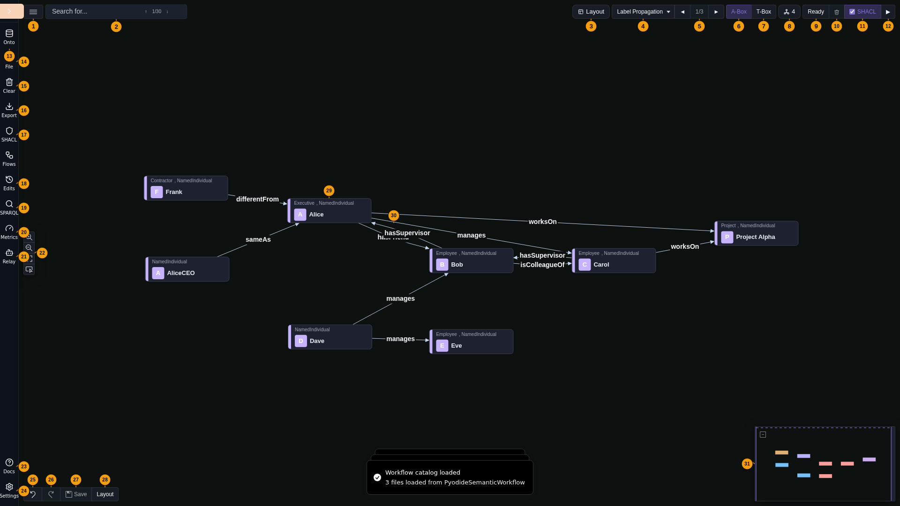

<div align="center">

# Ontosphere

**Browser-based RDF knowledge-graph editor with client-side OWL 2 DL reasoning, reasoner-verified repair, and a Model Context Protocol server for AI agents.**

[](https://thhanke.github.io/ontosphere)
&nbsp;[](https://thhanke.github.io/ontosphere/paper/)
&nbsp;[](#ai--mcp-integration)

[](https://doi.org/10.5281/zenodo.19605270)
[](LICENSE)


[](#contributing--development-notes)

</div>

> **Author, reason over, and repair RDF/OWL knowledge graphs entirely in your browser.**
> Ontosphere loads RDF from files, URLs, or SPARQL endpoints; lets you author nodes and edges on a live canvas; runs a *complete* OWL 2 DL reasoner (Konclude, compiled to WebAssembly) with inferred triples shown inline; proposes reasoner-verified repairs for inconsistencies; and exposes everything to AI agents through a Model Context Protocol server. No backend, no install — just a browser tab.

<div align="center">

| I want to… | Start here |
|------------|------------|
| 🚀 &nbsp;Try the live demo | [Open Ontosphere ↗](https://thhanke.github.io/ontosphere) |
| 🎬 &nbsp;Watch feature tutorials | [Video tutorials](#video-tutorials) |
| 🤖 &nbsp;Connect an AI agent | [AI / MCP integration](#ai--mcp-integration) |
| 💻 &nbsp;Run it locally | [Quick start](#quick-start-development) |
| 📂 &nbsp;Load my own data | [Startup / URL parameters](#startup--url-parameters) |
| 📄 &nbsp;Read the paper | [ISWC 2026 demo paper ↗](https://thhanke.github.io/ontosphere/paper/) |
| 🛠️ &nbsp;Contribute | [Contributing](#contributing--development-notes) |

</div>

## Table of Contents

- [Overview](#overview)
- [Key capabilities](#key-capabilities)
- [Video tutorials](#video-tutorials)
- [Using the UI](#using-the-ui)
- [Reasoning](#reasoning)
- [SHACL validation](#shacl-validation)
- [Startup / URL parameters](#startup--url-parameters)
- [AI / MCP Integration](#ai--mcp-integration)
  - [How it works](#how-it-works)
  - [Agent edit provenance](#agent-edit-provenance)
  - [Recommended workflow](#recommended-workflow)
  - [Using Ontosphere with any AI](#using-ontosphere-with-any-ai)
    - [Claude Code / Playwright](#claude-code--playwright-full-automation)
    - [AI Relay Bridge (ChatGPT, Gemini, Claude.ai)](#chatgpt-gemini-claudeai--ai-relay-bridge)
- **Developer**
  - [Quick start (development)](#quick-start-development)
  - [Reasoning demo (OWL 2 DL patterns)](#reasoning-demo-owl-2-dl-patterns)
  - [CORS and proxies](#cors-and-proxies)
  - [Developer utilities](#developer-utilities-window-globals)
  - [Troubleshooting](#troubleshooting)
  - [Recording demo videos](#recording-demo-videos)
  - [Contributing](#contributing--development-notes)
- [Acknowledgements](#acknowledgements)
- [Reproducibility and data availability](#reproducibility-and-data-availability)
- [License & authors](#license--authors)

Overview
--------
Ontosphere is a browser-based [RDF](https://www.w3.org/RDF/)/ontology knowledge graph editor. It loads RDF from local files, remote URLs, or SPARQL/Fuseki endpoints; lets users author nodes and edges directly on the canvas; runs complete [OWL 2 DL reasoning](https://www.w3.org/TR/owl2-profiles/#OWL_2_DL) (via Konclude) with visual differentiation of inferred triples; and applies multi-algorithm layout ([Dagre](https://github.com/dagrejs/dagre), [ELK](https://github.com/kieler/elkjs)) and automatic clustering for large graphs. Additional features include namespace management with live URI renaming, a drag-and-drop workflow template catalog, and a [Model Context Protocol (MCP)](https://modelcontextprotocol.io) server for AI-agent integration. All computation runs entirely client-side in the browser against an in-memory RDF store backed by Web Workers — no backend required.

```mermaid
flowchart LR
  Agent["LLM agent"]
  subgraph B["Browser tab — 100&#37; client-side, no backend"]
    direction TB
    UI["Reactodia canvas<br/>author · layout · cluster"]
    Store["RDF store<br/>named graphs · Web Workers"]
    Reason["OWL 2 DL reasoner<br/>Konclude · WebAssembly"]
    Check["OWL 2 profile + SHACL"]
    Repair["Repair engine<br/>deletion · weakening · laconic"]
    Diag["Diagnosis object<br/>verdict · justifications · verified repairs"]
    Prov["PROV-O provenance + reversal"]
    MCP["MCP server · 43 tools"]
  end
  Agent -->|"author / select a verified repair"| MCP
  MCP --> Store
  UI <--> Store
  Store --> Reason
  Store --> Check
  Reason --> Repair
  Check --> Repair
  Reason --> Diag
  Check --> Diag
  Repair --> Diag
  Diag -->|"verified, never-hidden feedback"| MCP
  Store --> Prov
```



<div align="center"><sub>The agent edits through the MCP tool surface; the client-side substrate verifies with a complete reasoner and returns one structured diagnosis with reasoner-verified repairs. Nothing leaves the browser.</sub></div>

Key capabilities
----------------
Everything below runs in the browser tab, against an in-memory RDF store backed by Web Workers. The capabilities group around what you do with a knowledge graph — **load**, **author**, **reason**, **repair**, **validate**, and **share** — plus first-class **AI-agent** access.

#### 📥 Load & interoperate
- Import **RDF / Turtle / JSON-LD / RDF-XML / N-Triples** from local files or remote URLs, including SPARQL endpoints and Fuseki datasets; auto-load on startup via a URL query parameter.
- Export single-graph **Turtle / RDF-XML / JSON-LD**, or dataset-faithful **N-Quads / TriG** that preserve the named-graph partition (data, inferred, shapes, ontologies, workflows) so a dataset round-trips on re-import.
- **W3C RDFC-1.0 canonicalization** ([RDF Dataset Canonicalization](https://www.w3.org/TR/rdf-canon/), W3C Recommendation 2024): produce the canonical N-Quads form and a SHA-256 **content hash** entirely in the browser. Deterministic blank-node labelling means two **isomorphic** graphs yield a byte-identical form and the same hash — a content-addressable identity for reproducible snapshots, deterministic diffs, and standards-compliant graph equality (`canonicalizeGraph` MCP tool).

#### ✍️ Author & explore
- **Always-on authoring** on a **Reactodia canvas** (pan, zoom, minimap, fit-view, clustering, smooth animations): add nodes via search, draw edges from the halo "Establish Link" handle, and edit annotations and predicates inline, with full **undo/redo**. Auto-complete is scored by domain/range tiers derived from the loaded ontologies.
- **Search** entities by label or IRI (Enter cycles matches on the canvas); toggle **TBox / ABox** views between ontology-level classes/properties and data-level individuals.
- **Layout at scale**: Dagre (horizontal/vertical) and ELK (layered, force, stress, radial) plus the Reactodia default, all in Web Workers with adjustable spacing. **Hierarchical fold levels** load with structural folding pre-applied (L2 subclass/collection collapse, L1 annotation hiding) and a depth badge; **community-detection clustering** (Label Propagation, Louvain, K-Means) applies automatically above a configurable node threshold (default 100). Each view tracks its fold state independently.
- **Namespace management**: rename namespace URIs in the legend (propagates across all stored triples), with colour-coded badges on nodes and edges. **Workflow catalog**: drag reusable template cards onto the canvas to instantiate connected subgraphs.

#### 🧠 Reason
- **Complete OWL 2 DL inference** in the browser via **Konclude (WebAssembly)**; inferred triples render as amber dashed edges and inferred types/annotations in amber italic, with a full inference report and one-click clearing that never touches asserted data.
- Automatic **consistency checking** with per-entity clash details in the Errors tab, **justifications** (MIPS) with laconic targeting, **OWL 2 profile** detection (EL/QL/RL/DL), and **locality-module** scoping for incremental/modular verification.

#### 🔧 Repair — reasoner-verified
- When the reasoner finds a contradiction (or SHACL reports a violation), a **Repairs** tab shows reasoner-computed, ranked, verified fixes — the same repairs the `explainDiagnostics` MCP tool hands an agent.
- Minimal hitting-set **deletion** plus, for `rdfs:subClassOf` culprits, **axiom weakening** that replaces `A ⊑ D` with a logically weaker `A ⊑ D′` to preserve more knowledge than deletion (Troquard et al. AAAI 2018; Li & Lambrix ISWC 2024). Each suggestion shows its rationale and the exact triples it adds/removes, with a "verified consistent" badge and a bounded **minimality** check. Apply a single deletion, **Apply weakening** as one undoable remove+add batch, or **Apply all verified** in one batch — then re-run reasoning to confirm.

#### ✅ Validate & track
- **SHACL validation** with focus node / path / constraint / severity reporting.
- **PROV-O provenance** of every agent edit, with diff and one-click **reversal** of a batch (faithful to typed and language-tagged literals), and a warning when retention truncates reversible history.

#### 🤖 AI / MCP integration — 43 tools
Exposes a [Model Context Protocol](https://modelcontextprotocol.io) server via the browser's `navigator.modelContext` API, across nine categories (manifest at `/.well-known/mcp.json`):

| Category | Tools |
|---|---|
| Graph management | `loadRdf` · `loadOntology` · `suggestOntologiesForTask` · `queryGraph` · `exportGraph` · `canonicalizeGraph` · `exportImage` · `setViewMode` · `getCapabilities` · `getGraphState` · `help` |
| Node operations | `addNode` · `removeNode` · `expandNode` · `getNodes` · `getNodeDetails` · `updateNode` · `searchTerms` |
| Link operations | `addTriple` · `removeLink` · `getLinks` |
| Layout & navigation | `runLayout` · `clusterNodes` · `layoutNodes` · `focusNode` · `fitCanvas` · `getNeighbors` · `findPath` |
| Reasoning | `runReasoning` · `clearInferred` · `explainDiagnostics` · `explainEntailment` · `extractModule` |
| Namespaces | `setNamespace` · `removeNamespace` · `listNamespaces` |
| SHACL validation | `loadShacl` · `validateGraph` · `loadShaclFromUrl` |
| Edit provenance / undo | `listAgentEdits` · `diffAgentEdits` · `revertAgentBatch` |
| Dataset metadata | `generateDatasetMetadata` (VoID + DCAT with triple/class/property counts, partitions and vocabularies, for FAIR publishing) |

Video tutorials
---------------

Short video walkthroughs for each core feature — click to play directly from the live deployment.

### Feature tutorials

Each video is a focused 60–90 second walkthrough using the bundled reasoning-demo ontology.

| Feature | Video | What you'll see |
|---------|-------|-----------------|
| **RDF Loading** | [▶ feat-loading.mp4](https://thhanke.github.io/ontosphere/demo-videos/feat-loading.mp4) | URL parameter load, file upload, SPARQL endpoint fetch |
| **Visual Exploration** | [▶ feat-exploration.mp4](https://thhanke.github.io/ontosphere/demo-videos/feat-exploration.mp4) | TBox/ABox toggle, search, zoom/pan, minimap |
| **Canvas Authoring** | [▶ feat-authoring.mp4](https://thhanke.github.io/ontosphere/demo-videos/feat-authoring.mp4) | Add class, draw edge, edit annotations, undo/redo |
| **Hierarchical Clustering** | [▶ feat-clustering.mp4](https://thhanke.github.io/ontosphere/demo-videos/feat-clustering.mp4) | L2 structural fold/unfold, L3 Louvain community detection |
| **OWL 2 DL Reasoning** | [▶ feat-reasoning.mp4](https://thhanke.github.io/ontosphere/demo-videos/feat-reasoning.mp4) | Konclude WASM inference, inferred triples, ABox inspection |
| **SHACL Validation** | [▶ feat-shacl.mp4](https://thhanke.github.io/ontosphere/demo-videos/feat-shacl.mp4) | Load shapes, validate data, reasoning interplay |
| **MCP + AI Relay** | [▶ feat-ai-relay.mp4](https://thhanke.github.io/ontosphere/demo-videos/feat-ai-relay.mp4) | Bookmarklet injection, AI tool calls, relay round trip |

### Workflow demos

Longer end-to-end sessions showing AI-driven ontology building.

| Demo | Video | Description |
|------|-------|-------------|
| **Full walkthrough** | [▶ iswc2026-comprehensive.mp4](https://thhanke.github.io/ontosphere/demo-videos/iswc2026-comprehensive.mp4) | 3-minute tour of all features |
| **FOAF social network** | [▶ foaf-social-network.mp4](https://thhanke.github.io/ontosphere/demo-videos/foaf-social-network.mp4) | AI builds a social graph with DL reasoning |
| **Scene ontology** | [▶ scene-ontology.mp4](https://thhanke.github.io/ontosphere/demo-videos/scene-ontology.mp4) | Film scene ontology on BFO/RO upper ontology |
| **Pizza tutorial** | [▶ pizza-tutorial.mp4](https://thhanke.github.io/ontosphere/demo-videos/pizza-tutorial.mp4) | Manchester Pizza — class hierarchy, disjointness, DL reasoning |
| **Pizza tutorial (chat)** | [▶ pizza-tutorial-chat.mp4](https://thhanke.github.io/ontosphere/demo-videos/pizza-tutorial-chat.mp4) | OWL pizza tutorial as AI tutor lesson, side-by-side chat |

Using the UI
------------

The annotated diagram below identifies the numbered UI elements described in this section.



### Top bar — left group

**1** **☰ View menu** — dropdown: Export canvas as PNG, Export as SVG, Print, Show/Hide Legend (toggles the namespace colour key panel).

**2** **Search** — type to find entities by label or IRI. ↑↓ arrows or **Enter** cycle through matches on the canvas. The badge shows current match / total count.

### Top bar — right group (action toolbar)

**3** **Layout** — opens the layout popover: choose algorithm (Dagre horizontal/vertical, ELK layered/force/stress/radial, Reactodia-default), adjust spacing via a slider, toggle auto-layout (re-runs after every graph update).

**4** **Clustering algorithm selector** — choose between None, Label Propagation, Louvain, or K-Means. The large-graph threshold (default 100 nodes, configurable in Settings) controls when auto-clustering runs on load.

**5** **Cluster level navigation** (◄ 1/3 ►) — step through fold levels. The badge shows the current level and total count: `L3` (community-detection clusters), `L2` (structural fold — subclass chains and OWL collections), `L1` (annotation properties hidden), `∅` (fully expanded). The ◄/► arrows fold or unfold one level at a time.

**6** **A-Box** — switch to instance-level individuals (A-Box, highlighted when active).

**7** **T-Box** — switch to ontology-level classes/properties (T-Box).

**8** **Ontologies** — shows the count of loaded ontologies. Click to open a popover listing each ontology with options to add/remove from autoload.

**9** **Reasoning status** — shows the current DL reasoning state: Ready / ✓ Valid / ⚠ Warnings / Errors / spinner while running. Click to open the reasoning report (inferred triples grouped by rule).

**10** **Clear inferred** (🗑) — removes all inferred triples without touching asserted data.

**11** **SHACL toggle** (☑) — enable or disable SHACL validation as part of the reasoning pipeline. When checked, running reasoning also validates data against loaded SHACL shapes.

**12** **Run reasoning** (▶) — triggers DL reasoning (Konclude) and optionally SHACL validation. Inferred triples appear as amber dashed edges. Idempotent.

### Left sidebar (collapsed icon rail)

**13** **Onto** — open the ontology loader. Enter any HTTP(S) URL or pick from pre-configured sources in Settings.

**14** **File** — open a file picker for local RDF files. Supported: Turtle (.ttl), JSON-LD (.jsonld), RDF/XML (.rdf/.owl), N-Triples (.nt).

**15** **Clear** — remove all loaded graphs and reset the canvas.

**16** **Export** — export as Turtle, JSON-LD, RDF/XML (single-graph), or N-Quads / TriG (dataset-faithful, preserves named graphs) via the dropdown. Generated entirely in the browser.

**17** **SHACL** — open the SHACL shapes panel to load, inspect, and manage SHACL shapes for data validation.

**18** **Agent Edits** — open the provenance inspector (see [Agent edit provenance](#agent-edit-provenance)). Lists edit batches, shows diffs, and offers one-click revert.

**19** **SPARQL** — open the SPARQL query editor (the same engine the `queryGraph` MCP tool uses). Prefills registered namespace `PREFIX` declarations, runs on **Run** or **Ctrl/⌘+Enter**, and renders results by type: SELECT bindings as a table, CONSTRUCT/DESCRIBE as triples, ASK as true/false, INSERT/DELETE with a success toast.

**20** **Metrics** — open the ontology metrics dashboard. Structural counts (triples, subjects, classes, properties, individuals) as stat cards, subjects-by-namespace breakdown, and OQuaRE-flavoured quality heuristics (properties per class, label coverage, inferred:asserted ratio).

**21** **AI Relay** — open the AI Relay Bridge panel. Drag the bookmarklet to your browser bar to connect any AI chat (ChatGPT, Gemini, Claude.ai) to Ontosphere.

**22** **Zoom controls** — zoom in/out, fit view (reset the viewport to show all nodes), and screenshot (export the current canvas view).

**23** **Docs** — open the built-in documentation and help panel.

**24** **Settings** — open the settings panel for default layout, clustering algorithm, large-graph threshold, ontology autoload URLs, workflow catalog, reasoner backend, and other preferences.

### Sidebar content (expanded)

When the sidebar is expanded (click the **›** toggle), the action buttons are shown in a compact grid. Below them the same sections appear as collapsible accordion panels with full content: **Workflows** (drag a template card onto the canvas to instantiate a connected subgraph), **SHACL Shapes**, **Agent Edits**, **SPARQL**, **Metrics**, **AI Relay**, and **Documentation**.

### Authoring toolbar (bottom left)

**25** **Undo** — undo last authoring change.

**26** **Redo** — redo last undone change.

**27** **Save** — commit all pending authoring edits to the RDF store in a single batch.

**28** **Re-layout** — re-apply the current layout algorithm in-place.

### Node authoring halo (visible on selected node)

Hover over any node to reveal the authoring halo with these controls:

- **Edit / Delete** — buttons that appear above a selected node. **Edit** opens the property editor (IRI, annotation properties, custom fields). **Delete** permanently removes the entity from the RDF store.
- **Remove** (✕) — removes the node from the canvas view without deleting it from the RDF store.
- **Establish Link** (plug icon, right side) — drag to another node to create a new edge. A dialog confirms the predicate with scored autocomplete from loaded ontologies.
- **Expand neighbours** (∧, bottom) — load and show all RDF neighbours of the node on the canvas.

### Canvas elements

**29** **Individual node** — represents an RDF subject. The header shows the local name, a coloured namespace badge, and the OWL class. Properties (IRI, annotations, custom fields) are shown in an editable table on selection.

**30** **Edge / predicate** — labelled arrow between two nodes. Amber dashed edges are inferred triples. Double-click to open the link property editor (scored autocomplete from ontologies).

**31** **Minimap** — overview panel at bottom-right. Click to jump to a region, drag to pan.

### Canvas interactions
- **Add a node**: type in **2** Search and press Enter to search the ontology; select a match to place it on the canvas.
- **Authoring mode** is always active: hover a node to reveal the halo.
- Drag the **Establish Link** handle to another node to create a new edge.
- Double-click an edge to open the link property editor.
- Scroll to zoom; drag the background to pan.
- Namespace legend panel: enable via **1** View menu → Show Legend. Click a namespace entry's pencil icon to rename its URI; renames propagate across all stored triples.
- Use the fit-view button (**22** Zoom controls) to reset the viewport.

Reasoning
---------

Ontosphere runs OWL reasoning entirely in the browser via a pluggable backend. The default is **Konclude** (full OWL 2 DL). Inferred triples appear as amber dashed edges; inferred types and annotations appear in amber italic. A reasoning report lists all inferred triples. Reasoning is idempotent — running it again produces no additional triples. Use **Clear inferred** to remove all inferred triples without affecting asserted data. See the [feat-reasoning demo video](https://thhanke.github.io/ontosphere/demo-videos/feat-reasoning.mp4) for a walkthrough of all 15 supported OWL 2 DL construct patterns.

**OWL DL consistency checking** runs automatically alongside inference (Konclude only). If the ontology is logically contradictory, reasoning is skipped and the report's **Errors** tab shows per-entity clash details (affected individual, violated axiom, description). An "OWL DL inconsistency detected" banner appears in the report. Common inconsistencies: an individual in two `owl:disjointWith` classes, an `owl:allValuesFrom` restriction violated by an asserted type, or an `owl:AsymmetricProperty` / `owl:IrreflexiveProperty` cycle. The N3 backend does not perform consistency checking (`isConsistent` is always `null`).

### Konclude (default — OWL 2 DL)

[Konclude](https://www.derivo.de/products/konclude/) is a complete tableau reasoner for the description logic **SROIQ(D)** (OWL 2 DL), compiled to WebAssembly. It runs classification over the loaded ontology and writes `rdfs:subClassOf` and `owl:equivalentClass` inferences.

**Supported OWL constructs (complete):** `rdfs:subClassOf`, `owl:equivalentClass`, `owl:someValuesFrom`, `owl:allValuesFrom`, `owl:hasValue`, `owl:inverseOf`, `owl:SymmetricProperty`, `owl:TransitiveProperty`, `owl:subPropertyOf`, `rdfs:domain`/`rdfs:range`, `owl:intersectionOf`, `owl:unionOf`, `owl:oneOf`, `owl:propertyChainAxiom`, number restrictions, nominals, and more.

### N3 Rules (legacy / advanced)

The N3 backend uses the **N3.js BGP-only Reasoner** with configurable rulesets loaded from `public/reasoning-rules/`. Select it in *Settings → Reasoner Backend → N3 Rules*.

N3.js is BGP-only: rules using EYE/SWAP built-ins (`e:findall`, `list:in`, `log:notEqualTo`) are silently ignored. The `[REQUIRES EYE]` comments in the rule files mark those rules. Use this backend when you need custom N3 rule files or are working with demos that depend on specific rule-file behavior.

SHACL validation
-----------------
Ontosphere validates RDF data against [SHACL](https://www.w3.org/TR/shacl/) (Shapes Constraint Language) shapes. SHACL shapes define constraints on your data — required properties, value ranges, cardinality — and the validation engine reports which nodes violate them. See the [feat-shacl demo video](https://thhanke.github.io/ontosphere/demo-videos/feat-shacl.mp4) for a walkthrough.

SHACL validation runs automatically as part of the reasoning pipeline. After reasoning completes, the reasoning report shows SHACL violations alongside OWL inferences, with **SHACL** / **OWL** source badges on each finding. Only SHACL errors (severity `sh:Violation`) mark the data as invalid; warnings (`sh:Warning`) and info-level findings do not.

Affected nodes display validation badges directly on the canvas — red for errors, amber for warnings. Clicking a finding in the reasoning report navigates to the affected node.

### Loading shapes

| Method | Description |
|--------|-------------|
| `?shaclShapes=` URL parameter | Direct `.ttl` URL, GitHub folder URL, or comma-separated list |
| Settings → SHACL tab | Persistent shapes URL with bundled presets |
| MCP tool `loadShaclFromUrl` | AI-agent-driven shape loading |

Shapes are loaded into the `urn:vg:shapes` named graph, which is excluded from OWL reasoning. The sidebar **SHACL Shapes** panel shows loaded shapes with their target classes, constraint messages, and severity levels.

### Bundled shape presets

| Preset | Target | Checks |
|--------|--------|--------|
| Ontology Quality | `owl:Class`, `owl:ObjectProperty`, `owl:DatatypeProperty` | `rdfs:label`, `rdfs:comment`, `rdfs:domain`, `rdfs:range` |
| SKOS Quality | `skos:Concept`, `skos:ConceptScheme` | `skos:prefLabel`, `skos:inScheme`, `rdfs:label` |
| Reasoning Demo | `ex:Project`, `ex:Contractor`, `ex:Employee`, `owl:NamedIndividual` | Missing descriptions, supervisors, job titles |

### SHACL demo

The SHACL demo loads the reasoning-demo ontology with purpose-built shapes that produce both errors and warnings:

[Open SHACL demo ↗](https://thhanke.github.io/ontosphere/?rdfUrl=https://raw.githubusercontent.com/ThHanke/ontosphere/refs/heads/main/public/reasoning-demo.ttl&shaclShapes=https://raw.githubusercontent.com/ThHanke/ontosphere/refs/heads/main/public/shacl-shapes/reasoning-demo.shacl.ttl)

After loading, click **▶** (Run Reasoning) in the toolbar. The report will show:

- **2 errors** (sh:Violation): `projectAlpha` missing `rdfs:comment`; `frank` (Contractor) missing `ex:hasSupervisor`
- **12 warnings** (sh:Warning): employees missing `ex:jobTitle`; all individuals missing `rdfs:comment`

Each finding links to the affected node — click to close the dialog and navigate to it on the canvas. Error and warning badges appear directly on affected nodes.

Startup / URL parameters
------------------------
Ontosphere supports several URL query parameters that control what is loaded on startup.

### RDF data URL

| Parameter | Aliases        | Description |
|-----------|----------------|-------------|
| `rdfUrl`  | `url`, `vg_url` | HTTP(S) URL of an RDF resource to load on startup. |

**Supported sources:**

1. **Plain RDF files** — Turtle (.ttl), N-Triples (.nt), N3, RDF/XML, JSON-LD. Format is detected from `Content-Type` and file extension.
   ```
   ?rdfUrl=https://example.org/mydata.ttl
   ```

2. **SPARQL endpoints** — URLs whose path ends with `/sparql` or `/query` are recognised automatically. Ontosphere issues a `CONSTRUCT { ?s ?p ?o } WHERE { { ?s ?p ?o } UNION { GRAPH ?g { ?s ?p ?o } } }` query.
   ```
   ?rdfUrl=https://example.org/fuseki/$/sparql
   ```

3. **Fuseki dataset root** — Returns the full dataset; named-graph quads are flattened into the data graph.
   ```
   ?rdfUrl=https://docker-dev.iwm.fraunhofer.de/dataset/<uuid>/fuseki/$/
   ```

### Authentication (API key)

| Parameter      | Default         | Description |
|----------------|-----------------|-------------|
| `apiKey`       | —               | Value sent as an authentication header with the RDF fetch. |
| `apiKeyHeader` | `Authorization` | Name of the HTTP header. |

```text
?rdfUrl=https://private-endpoint.example.org/data.ttl
&apiKey=Bearer+my-token
&apiKeyHeader=Authorization
```

The API key is sent only with the RDF fetch request. CORS: the server must allow the Ontosphere origin with credentials (wildcard `*` origins are incompatible with authenticated requests).

### Ontology pre-loading

| Parameter    | Description |
|--------------|-------------|
| `ontologies` | Comma-separated list of ontologies that **replaces** the configured autoload list entirely. Each value is a well-known short name (see table below) or a full HTTPS/HTTP URI. Use `?ontologies=owl,rdf,rdfs` to load only the W3C core vocabs. |
| `ontology`   | Comma-separated list of ontologies to load **in addition to** the configured autoload list. |

```text
?ontologies=owl,rdf,rdfs           # replace defaults — load only W3C core vocabs
?ontology=bfo,dcat                 # add on top of configured autoload list
?ontology=bfo2020,https://example.org/myontology.ttl
```

**Well-known short names:**

| Short name | Ontology |
|------------|----------|
| `rdf`      | RDF Concepts Vocabulary |
| `rdfs`     | RDF Schema |
| `owl`      | OWL |
| `skos`     | SKOS |
| `prov`     | PROV-O – The PROV Ontology |
| `p-plan`   | P-Plan Ontology |
| `bfo`      | BFO 2.0 – Basic Formal Ontology 2.0 |
| `bfo2020`  | BFO 2020 – Basic Formal Ontology 2020 |
| `dcat`     | DCAT – Data Catalog Vocabulary |
| `foaf`     | FOAF |
| `dcterms`  | Dublin Core Terms |
| `qudt`     | QUDT |
| `iof-core` | IOF Core |

### Import discovery

| Parameter     | Default | Description |
|---------------|---------|-------------|
| `loadImports` | `true`  | Set to `false` to disable automatic loading of `owl:imports` referenced in the loaded RDF. Overrides the per-session app setting without persisting it. |

```text
?rdfUrl=https://example.org/data.ttl&loadImports=false
```

### SHACL shapes

| Parameter      | Description |
|----------------|-------------|
| `shaclShapes`  | URL of SHACL shapes to load on startup. Accepts a direct `.ttl` URL, a GitHub folder URL, or a comma-separated list. Overrides the configured shapes URL for this session. |

```text
?rdfUrl=https://example.org/data.ttl&shaclShapes=/shacl-shapes/ontology-quality.shacl.ttl
```

### Full example (CKAN private dataset via Fuseki SPARQL)

```text
http://docker-dev.iwm.fraunhofer.de:8080/
  ?rdfUrl=https://docker-dev.iwm.fraunhofer.de/dataset/<uuid>/fuseki/$/sparql
  &apiKey=<ckan-api-jwt-token>
```

### Startup loading order

All startup mechanisms are additive and run in this order:

1. Configured additional ontologies (app settings → *persistedAutoload*)
2. RDF data graph (`rdfUrl` / `url` / `vg_url`)
3. Ontologies from `?ontology=` URL parameter
4. `owl:imports` discovery (runs after each load unless `?loadImports=false`)

AI / MCP Integration
--------------------

Ontosphere exposes a full [Model Context Protocol](https://modelcontextprotocol.io) tool surface so AI agents can build and reason over knowledge graphs through natural-language chat. See the [feat-ai-relay demo video](https://thhanke.github.io/ontosphere/demo-videos/feat-ai-relay.mp4) for a walkthrough, or the [workflow demos](#workflow-demos) for full AI-driven sessions.

### How it works

The app has two coupled layers:

- **N3 RDF store** — source of truth. `addNode` / `addLink` write triples here.
- **Reactodia canvas** — visual mirror. Nodes are *not* created automatically from triples; you must call `addNode` to place a subject on canvas. After adding triples, canvas links refresh automatically. Nodes start collapsed — call `expandNode` (with an IRI to expand one node, or no args to expand all) to reveal annotation property cards.

DL reasoning (Konclude) writes inferred triples back to the store and refreshes the canvas.

### Agent edit provenance

Every mutating MCP tool call is recorded as a PROV-O edit batch. Three tools expose the journal to agents:

| MCP tool | Purpose |
|----------|---------|
| `listAgentEdits` | List recorded edit batches (most recent first) with `batchId`, `tool`, `agent`, `timestamp`, `addedCount`, `removedCount`, `reverted` |
| `diffAgentEdits` | Inspect the exact triples a batch added and removed |
| `revertAgentBatch` | Undo a batch — re-removes its added triples and re-adds its removed triples; idempotent and best-effort |

The sidebar **Agent Edits** panel surfaces the same journal in the UI: it lists edit batches most-recent-first (tool, timestamp, `+added`/`−removed` counts, agent, and a *reverted* badge), expands each batch to show its added (green) and removed (struck-through red) triples with abbreviated IRIs, and offers a one-click **Revert** button per batch. The panel refreshes automatically as agents make or revert edits.

The `urn:vg:provenance` graph is excluded from OWL reasoning, consistency checking, SHACL validation, and data export, so provenance metadata never pollutes the ontology. The edit journal is held in memory; like the rest of the in-memory store it is volatile and cleared on page reload. To keep memory bounded during long autonomous sessions, only the most recent 5 000 edits are retained — older batches are evicted and can no longer be listed or reverted.

### Example output

An AI agent built this from scratch in one session — [full demo with tool calls →](docs/mcp-demo/foaf-social-network.md)

[](docs/mcp-demo/foaf-social-network.md)

### Recommended workflow

```text
loadOntology (TBox)
  → addNode ×N  (ABox individuals, rdf:type set)
  → addLink ×N  (object-property triples, edges appear on canvas)
  → runLayout   (dagre-lr recommended)
  → expandNode  (reveal annotation property cards — omit iri to expand all)
  → runReasoning (infer subClass / domain / range entailments; isConsistent=false signals contradiction)
  → fitCanvas + exportImage   (SVG snapshot, token-efficient)
  → exportGraph(turtle)       (final deliverable)
```

### Demo

| Demo | Final state |
|------|-------------|
| **[FOAF social network](docs/mcp-demo/foaf-social-network.md)**<br>Build a social network, extend FOAF with employment classes, run reasoning | [](docs/mcp-demo/foaf-social-network.md) |
| **[DL reasoning (Konclude)](docs/mcp-demo/reasoning-demo.md)**<br>Build TBox + ABox, infer types via domain/range and transitivity | [](docs/mcp-demo/reasoning-demo.md) |
| **[Scene ontology](docs/mcp-demo/scene-ontology.md)**<br>Load an external ontology, author individuals, export Turtle | [](docs/mcp-demo/scene-ontology.md) |
| **[Manchester Pizza Tutorial](docs/mcp-demo/pizza-tutorial.md)**<br>Full OWL pizza ontology — classes, disjointness, properties, DL reasoning | [](docs/mcp-demo/pizza-tutorial.md) |

### Using Ontosphere with any AI

The demo scripts work against the **live deployment** — no local server needed. Any AI that can drive a browser (Claude Code, headless Playwright, computer-use agents) can use Ontosphere directly via its MCP tools.

#### Claude Code / Playwright (full automation)

Point the demo scripts at the deployed app:

```sh
node scripts/mcp-demo-reasoning.mjs --url https://thhanke.github.io/ontosphere
node scripts/mcp-demo-foaf.mjs       --url https://thhanke.github.io/ontosphere
```

The script opens a headless browser, navigates to the URL, registers the MCP tools, then drives the full workflow — building TBox + ABox, running reasoning, taking snapshots, exporting Turtle — exactly as shown in the demo documents.

#### ChatGPT, Gemini, Claude.ai — AI Relay Bridge

The **AI Relay Bridge** connects any AI chat tab to Ontosphere with no server, extension, or copy-paste. A bookmarklet watches the AI's output for backtick-wrapped JSON-RPC 2.0 tool calls, executes them in Ontosphere via a BroadcastChannel popup, and injects JSON-RPC responses back into the chat input automatically.

➡️ **[Full setup guide: docs/relay-bridge.md](docs/relay-bridge.md)**

**Setup (one time):**
1. Open Ontosphere, expand the **AI Relay** sidebar panel
2. Drag the **Ontosphere Relay** button to your browser bookmark bar
3. Go to your AI chat tab and click the bookmark — a small relay popup opens

**Starter prompt** (paste into your AI chat after clicking the bookmarklet):

```text
You are connected to Ontosphere via a relay. A script in this tab intercepts your tool calls, runs them in Ontosphere, and injects results back as a user message. If a tool call returns success:false, read the error, fix the argument, and retry the same call immediately — never skip a failed call. Ask the user what they would like to build.

Output format — one JSON-RPC 2.0 call per line, backtick-wrapped:
`{"jsonrpc":"2.0","id":<N>,"method":"tools/call","params":{"name":"<toolName>","arguments":{...}}}`

Call help first to get full instructions and the tool list:
`{"jsonrpc":"2.0","id":0,"method":"tools/call","params":{"name":"help","arguments":{}}}`
```

The relay handles execution and result feedback automatically — no manual copy-paste needed.

Full tool declarations with input schemas: [public/.well-known/mcp.json](public/.well-known/mcp.json)

---

Developer
=========

<details id="quick-start-development">
<summary><strong>Quick start (development)</strong></summary>

1. Install dependencies:
   ```sh
   npm install
   ```
2. Start the Vite dev server:
   ```sh
   npm run dev
   ```
3. Open in your browser:
   ```text
   http://localhost:8080/
   ```

**Deployment requirement:** Konclude's WASM binary uses `SharedArrayBuffer` (pthreads). The server must send `Cross-Origin-Opener-Policy: same-origin` and `Cross-Origin-Embedder-Policy: credentialless` headers. Localhost deployments have `SharedArrayBuffer` available without headers. Ontosphere's `server.js` sets these headers automatically.

**Performance:** Konclude: 250 ms – 2.5 s for typical benchmark ontologies (LUBM, GALEN, Pizza). N3: under 2 seconds for typical ontologies (hundreds to a few thousand triples).

### Other startup mechanisms

- `window.__VG_STARTUP_TTL` — inline Turtle string loaded before any URL parameter.
- `window.__VG_STARTUP_URL` — programmatic URL override (takes precedence over `rdfUrl`).
- `VITE_STARTUP_URL` environment variable — build-time default startup URL.

### Setup (Playwright / headless)

`navigator.modelContext` does not exist in headless Chromium. Inject the polyfill **before** the page loads using `page.addInitScript`:

```js
await page.addInitScript(() => {
  const tools = {};
  Object.defineProperty(navigator, 'modelContext', {
    value: { registerTool: async (n, _d, _s, h) => { tools[n] = h; } },
    configurable: true,
  });
  window.__mcpTools = tools;
});

// After page load:
await page.evaluate(async () => {
  const mod = await import('/src/mcp/ontosphereMcpServer.ts');
  await mod.registerMcpTools();
});

// Call a tool:
await page.evaluate(async ([name, params]) => window.__mcpTools[name](params),
  ['addNode', { iri: 'ex:alice', typeIri: 'foaf:Person', label: 'Alice' }]);
```

In a browser with native `navigator.modelContext`, tools register automatically on app load.

### URL parameters (MCP)

| Parameter | Effect |
|-----------|--------|
| `?url=<encoded-url>` | Load RDF from URL on startup |
| `?ontology=foaf` | Pre-load FOAF ontology |
| `?loadImports=false` | Skip owl:imports auto-loading |

### Regenerate demos

```sh
npm run demo:all
# or individually:
node scripts/run-demo.mjs docs/mcp-demo/seeds/foaf-social-network.md
node scripts/run-demo.mjs docs/mcp-demo/seeds/reasoning-demo.md
node scripts/run-demo.mjs docs/mcp-demo/seeds/scene-ontology.md
node scripts/run-demo.mjs docs/mcp-demo/seeds/pizza-tutorial.md
```

</details>

<details id="reasoning-demo-owl-2-dl-patterns">
<summary><strong>Reasoning demo (OWL 2 DL patterns)</strong></summary>

The reasoning demo showcases OWL 2 DL / SROIQ(D) inference on a small employee ontology:
[Open demo ↗](https://thhanke.github.io/ontosphere/?rdfUrl=https://raw.githubusercontent.com/ThHanke/ontosphere/refs/heads/main/public/reasoning-demo.ttl)

The demo (`public/reasoning-demo.ttl`) defines a Person → Employee → Manager → Executive hierarchy with ABox assertions that drive inference patterns across all OWL 2 DL construct groups:

**OWL 1 RL patterns:**
1. **rdfs:subPropertyOf** — `ex:hasFriend` sub-property of `ex:knows`: `alice hasFriend bob` → `alice knows bob`.
2. **owl:inverseOf** — `ex:isManagedBy` inverse of `ex:manages`: `alice manages carol` → `carol isManagedBy alice`.
3. **owl:SymmetricProperty** — `ex:isColleagueOf` is symmetric: `bob isColleagueOf carol` → reverse direction.
4. **owl:TransitiveProperty** — `ex:hasSupervisor` is transitive: `bob→alice`, `alice→dave` → `bob→dave`.
5. **rdfs:domain** — `ex:dave` has no type; because he is subject of `ex:manages` (domain `ex:Manager`), the reasoner infers `dave rdf:type ex:Manager`.

**OWL 2 DL extensions:**
6. **owl:someValuesFrom** — `alice` and `carol` each `worksOn projectAlpha` (a `Project`) → inferred `ProjectContributor`.
7. **owl:hasValue** — `carol isManagedBy alice` (via inverseOf) → `carol` inferred `DirectReport` (hasValue restriction on alice).
8. **owl:intersectionOf** — `dave` manages `bob` (inferred Manager) and `eve` (Employee) → `dave` inferred `TeamLead`.
9. **owl:disjointWith** — `Contractor disjointWith Employee`; `frank` is a `Contractor` (structural TBox constraint).
10. **owl:complementOf** — `NonEmployee ≡ ¬Employee` (structural TBox only).
11. **owl:propertyChainAxiom** — `hasGrandManager ← hasSupervisor ∘ hasSupervisor`: `carol→bob→alice` → `carol hasGrandManager alice`.
12. **owl:unionOf** — `LeadershipTeam ≡ Executive ∪ Manager`: `alice` (Executive) and `dave` (inferred Manager) → inferred `LeadershipTeam`.
13. **owl:sameAs** — `aliceCEO sameAs alice`: `aliceCEO` inherits all of `alice`'s inferred types including `Executive`.
14. **owl:allValuesFrom** — `DirectorRole ≡ ∀manages.Executive`: structural TBox axiom demonstrating universal restrictions.
15. **rdfs:domain / rdfs:range** — `ex:manages` has domain `ex:Manager` and range `ex:Employee`: `dave manages bob` → `dave rdf:type ex:Manager` (domain inference) and `bob rdf:type ex:Employee` (range inference).

A separate **inconsistency demo** (`public/reasoning-demo-inconsistent.ttl`) shows the consistency checker in action:
[Open inconsistency demo ↗](https://thhanke.github.io/ontosphere/?rdfUrl=https://raw.githubusercontent.com/ThHanke/ontosphere/refs/heads/main/public/reasoning-demo-inconsistent.ttl)

`inc:frank` is asserted as both `inc:Employee` and `inc:Contractor`, which are declared `owl:disjointWith`. Running reasoning produces `isConsistent: false`, reasoning is skipped, and the report's Errors tab shows the disjointness clash on `frank`.

</details>

<details id="cors-and-proxies">
<summary><strong>CORS and proxies</strong></summary>

Ontosphere fetches remote RDF directly from the browser. If the remote host does not allow cross-origin requests, the fetch will be blocked.

**Well-known ontologies** (FOAF, SKOS, PROV-O, Dublin Core, QUDT, etc.) are pre-configured with CORS-friendly fetch URLs (W3C, dublincore.org, LOV, qudt.org) and load without any proxy.

**Custom ontology URLs** that lack CORS headers require a proxy. Configure one in Settings → Advanced → CORS Proxy URL. The proxy must:
- Accept a URL-encoded target as a query parameter: `https://your-proxy/?url=<encoded>`
- Forward the `Accept` header to the target server
- Not restrict RDF MIME types (`text/turtle`, `application/rdf+xml`, etc.)

> **Note:** `corsproxy.io` free tier blocks RDF content types and will not work. Self-hosted options that do work: a [Cloudflare Worker](https://developers.cloudflare.com/workers/) using the cors-anywhere pattern, or a local Vite dev-server proxy.

Workarounds for development:
- Use CORS-enabled hosting for the RDF file.
- Configure a local dev proxy in your Vite config to forward the request.

</details>

<details id="developer-utilities-window-globals">
<summary><strong>Developer utilities (window globals)</strong></summary>

The following debug flags can be set in the browser console to enable diagnostic output. All are gated — they only activate when `window.__VG_DEBUG__` is truthy (or `config.debugAll` is enabled in Settings):

- `window.__VG_DEBUG__` — master debug gate. Set to `true` to enable all `[VG_*]` diagnostic console output.
- `window.__VG_LOG_RDF_WRITES` — log RDF triple writes to the console.
- `window.__VG_DEBUG_STACKS__` — capture stack traces in debug messages.
- `window.__VG_DEBUG_SUMMARY__` — read-only object populated by the startup debug harness with fallback and timing data.

All flags are also persisted from `config.debugAll` (toggleable in Settings → Debug). Setting `config.debugAll = true` via Settings is the recommended way to enable diagnostics without console access.

</details>

<details id="troubleshooting">
<summary><strong>Troubleshooting</strong></summary>

- **rdfUrl doesn't load on open:**
  - Confirm the URL is percent-encoded in the address bar.
  - Open DevTools → Network and check the fetch request and response headers.
  - Look for CORS errors (`Access-Control-Allow-Origin`).
  - Check the console for RDF parser errors or application diagnostics.
- **403 when using certain query parameter names:**
  - Some servers intercept reserved query names. Use `?rdfUrl=...` to avoid conflicts.
- **Graph is very large / slow:**
  - Increase the large-graph threshold in Settings or reduce the number of loaded triples.
  - Clustering activates automatically above the threshold; use Expand All sparingly on huge graphs.

</details>

<details id="recording-demo-videos">
<summary><strong>Recording demo videos</strong></summary>

See [docs/demo-scripts/HOWTO.md](docs/demo-scripts/HOWTO.md) for the full guide. All videos are listed in [Video tutorials](#video-tutorials) above.

Three styles of demo video are supported:

**Seed-driven** — write a seed markdown file in `docs/mcp-demo/seeds/` with JSON-RPC
tool calls and `` ```action `` UI action blocks. The runner parses the seed and executes each
step (tool calls via `window.__mcpTools`, UI actions via Playwright locators).

**Chat-style (side-by-side)** — open `demo-stage.html` (mock chat left, app right),
inject messages programmatically via `addChatMessage()`, and call tools on the app
iframe via `callToolOnStage()`. No relay popup needed. Example: `pizza-tutorial-chat`.

**Feature demos** — focused 60–90 second demos, one per paper feature section. All use
`reasoning-demo.ttl` as the shared dataset. Seeds mix MCP tool calls with UI action blocks.

To re-record all videos:
```sh
npm run demo:video   # starts dev server, records, encodes, kills server
```

</details>

Contributing / Development notes
---------------------------------
- Canvas & top bar: [src/components/Canvas/](src/components/Canvas/)
- Cluster algorithms: [src/components/Canvas/core/clusterAlgorithms/](src/components/Canvas/core/clusterAlgorithms/)
- Layout functions: [src/components/Canvas/layout/](src/components/Canvas/layout/)
- Search widget: [src/components/Canvas/search/](src/components/Canvas/search/)
- RDF worker and protocol: [src/workers/](src/workers/)
- MCP server and tools: [src/mcp/](src/mcp/)
- Tests: [src/__tests__/](src/__tests__/) — run with `npm test`.

Acknowledgements
-----------------

Ontosphere builds on several open-source projects whose authors we gratefully acknowledge.

**Core components:**
[Konclude](https://github.com/konclude/Konclude) ([Andreas Steigmiller](https://github.com/andreas-steigmiller), Thorsten Liebig, Birte Glimm; University of Ulm) — OWL 2 DL tableau reasoner, compiled to WebAssembly via [rdf-reasoner-konclude](https://github.com/ThHanke/rdf-reasoner-konclude);
[Reactodia](https://github.com/reactodia/reactodia-workspace) (Dmitry Mouromtsev et al.) — visual graph editor;
[N3.js](https://github.com/rdfjs/N3.js) (Ruben Verborgh, Ruben Taelman) — in-memory RDF store and parser;
[shacl-engine](https://github.com/zazuko/shacl-engine) (Thomas Bergwinkl) — SHACL constraint validation.

**Layout & graph algorithms:**
[ELK](https://github.com/kieler/elkjs),
[Dagre](https://github.com/dagrejs/dagre),
[ngraph.louvain](https://github.com/nickolay/ngraph.louvain) / [ngraph.slpa](https://github.com/nickolay/ngraph.slpa),
[ml-kmeans](https://github.com/mljs/kmeans).

**RDF & SPARQL:**
[@rdfjs/data-model](https://github.com/rdfjs-base/data-model) / [@rdfjs/dataset](https://github.com/rdfjs-base/dataset),
[rdf-parse](https://github.com/rubensworks/rdf-parse.js),
[sparqljs](https://github.com/RubenVerborgh/SPARQL.js),
[Comunica](https://github.com/comunica/comunica).

**UI framework:**
[React](https://react.dev),
[Radix UI](https://www.radix-ui.com),
[Tailwind CSS](https://tailwindcss.com),
[Vite](https://vite.dev),
[Lucide](https://lucide.dev),
[shadcn/ui](https://ui.shadcn.com).

This work was supported by the [Fraunhofer Institute for Mechanics of Materials IWM](https://www.iwm.fraunhofer.de/).

See [ACKNOWLEDGEMENTS.md](ACKNOWLEDGEMENTS.md) for full details.

Reproducibility and data availability
--------------------------------------

### License

Ontosphere is released under the [Apache 2.0 License](LICENSE). The source code, benchmark data, and study scripts are all openly available under the same terms.

### Persistent identifier and citation

The software is archived on Zenodo under the concept DOI
[10.5281/zenodo.19605270](https://doi.org/10.5281/zenodo.19605270).
A version-specific DOI is minted automatically by Zenodo for each tagged GitHub release.
Cite using the metadata in `CITATION.cff` (CFF 1.2.0).

### Reproducible build

All dependencies are pinned via `package-lock.json`. A clean, reproducible build from source:

```sh
npm ci            # install exact locked versions
npm run build     # Vite production build → dist/
npm test          # unit tests (Vitest)
npm run typecheck:ratchet  # TypeScript error ratchet
```

**Docker one-liner** (no Node installation required):

```sh
# Build the image
docker build -t ontosphere:latest .

# Run the static server (opens on http://localhost:8080)
docker run --rm -p 8080:8080 ontosphere:latest
```

The Dockerfile uses a two-stage build (Node 22 slim builder → Node 22 slim server) and pins
the base image by tag. The production stage serves `dist/` via a minimal Express static server
(`docker-static-server.js`) that sets the required cross-origin isolation headers (see below).

### Cross-origin isolation requirement (WASM reasoner)

The Konclude OWL 2 DL reasoner is compiled to WebAssembly and uses `SharedArrayBuffer`
(pthreads). Browsers require two HTTP response headers for `SharedArrayBuffer` to be available:

```
Cross-Origin-Opener-Policy: same-origin
Cross-Origin-Embedder-Policy: credentialless
```

Both the development server (`server.js`) and the Docker production server
(`docker-static-server.js`) set these headers automatically. If you serve `dist/` via a
different static file server (nginx, Caddy, GitHub Pages, etc.), configure it to emit these
headers or the WASM reasoner will silently fall back to a non-threaded mode.

### OntoAuthor-Mat benchmark

The **OntoAuthor-Mat** benchmark — six ontology-authoring tasks for materials science covering
OWL 2 DL patterns — accompanies the [ISWC 2026 demo paper](https://thhanke.github.io/ontosphere/paper/).
Task data lives in [`benchmarks/ontoauthor-mat/`](benchmarks/ontoauthor-mat/).

| Task | OWL 2 DL pattern | Domain scenario | SHACL shapes | CQ queries |
|------|------------------|-----------------|:------------:|:----------:|
| T1 | `rdfs:subClassOf` (subsumption) | Steel alloy classification hierarchy | 6 | 2 |
| T2 | `owl:someValuesFrom` (existential) | Composite materials and constituents | 5 | 2 |
| T3 | `owl:allValuesFrom` (universal) | Certified-only material suppliers | 5 | 2 |
| T4 | `owl:disjointWith` | Metallic vs. ceramic categories | 5 | 2 |
| T5 | `owl:sameAs` (identity) | Merging duplicate material entries | 4 | 2 |
| T6 | Unsatisfiability detection | Contradictory material classification | 3 | 2 |

Each task provides a natural-language brief (`task.md`), a gold-standard OWL 2 DL reference
solution (`reference.ttl`), SHACL shapes for automated scoring (`shapes.ttl`), and competency
questions as SPARQL ASK queries (`cq.sparql`). Scoring runs three axes per task: SHACL
conformance, competency-question pass rate, and reasoning correctness (Konclude classification
or consistency check).

#### Reference-solution results (gold standard)

| Task | OWL 2 DL Pattern | SHACL | CQ | Reasoning | Score | Load | SHACL | Reasoning | CQ | Total |
|------|------------------|-------|----|-----------|-------|-----:|------:|----------:|---:|------:|
| T1 | Subsumption | 6/6 | 2/2 | ✓ | 9/9 | 1 719 ms | 204 ms | 2 202 ms | 358 ms | 4 484 ms |
| T2 | Existential (∃) | 5/5 | 2/2 | ✓ | 8/8 | 1 742 ms | 197 ms | 2 211 ms | 397 ms | 4 547 ms |
| T3 | Universal (∀) | 5/5 | 2/2 | ✓ | 8/8 | 1 710 ms | 191 ms | 2 235 ms | 386 ms | 4 522 ms |
| T4 | Disjointness | 5/5 | 2/2 | ✓ | 8/8 | 1 704 ms | 192 ms | 2 240 ms | 356 ms | 4 493 ms |
| T5 | owl:sameAs | 4/4 | 2/2 | ✓ | 7/7 | 1 714 ms | 199 ms | 2 211 ms | 375 ms | 4 498 ms |
| T6 | Unsatisfiability | 3/3 | 2/2 | ✓ | 6/6 | 1 706 ms | 191 ms | timeout¹ | 347 ms | 18 249 ms |
| | **Total** | **28/28** | **12/12** | **6/6** | **46/46** | 10.3 s | 1.2 s | 27.1 s | 2.2 s | 40.8 s |

¹ Konclude WASM hangs on the inconsistency check for T6 (disjointness clash); the 15 s timeout
is treated as "inconsistent detected". The structural correctness of the contradiction is
verified by SHACL + CQ independently of the reasoner. Headless Chromium, Node.js, single run.

#### Reproduce

```sh
# Start the dev server, then:
node scripts/bench-ontoauthor-mat.mjs              # all tasks
node scripts/bench-ontoauthor-mat.mjs --task t1    # single task
node scripts/bench-ontoauthor-mat.mjs 2>&1 | tee logs/bench-ontoauthor-mat.log
```

### Konclude WASM reasoning performance

Benchmark data from [rdf-reasoner-konclude](https://github.com/ThHanke/rdf-reasoner-konclude)
comparing native Konclude (Docker) vs the Emscripten WASM port used in Ontosphere.

| Ontology | Expressivity | Triples | Native | WASM | Ratio | Inferred |
|----------|:------------:|--------:|-------:|-----:|------:|---------:|
| LUBM schema | SHI | 307 | 32 ms | 272 ms | ~8.5× | 44 |
| GALEN | SHIF | 30 817 | 228 ms | 656 ms | ~2.9× | 3 287 |
| Roberts family | SROIQ | 3 866 | 2 213 ms | 30 124 ms | ~13.6× | 269 829 |
| LUBM + data | SHI | 100 850 | 164 ms | 1 424 ms | ~8.7× | 138 522 |

Native = Konclude v0.7.0, Docker, 8 threads. WASM = Emscripten pthreads, Node.js, median of 3 runs.
Ratio = WASM classify / native classify. For typical interactive ontologies (< 10 000 triples),
Konclude WASM completes classification in 250 ms – 2.5 s.

### Module-extraction benchmark

Syntactic-locality star-module extraction for incremental reasoning
(see [`scripts/bench-reasoning.mjs`](scripts/bench-reasoning.mjs)):

```sh
node scripts/bench-reasoning.mjs 2>&1 | tee logs/bench-reasoning.log
```

### LLM transparency

Model identifiers, prompt templates, and archived response logs for all study conditions
are provided alongside the benchmark tasks. The model adapter records the exact model ID
and sampling parameters used for each run. Raw model outputs (before scoring) are preserved
so every reported result can be traced back to a specific model response.

### Data Availability Statement

All software, benchmark data, and study scripts necessary to reproduce the results reported
in the paper are openly available. The source code is hosted at
<https://github.com/ThHanke/ontosphere> and archived on Zenodo at
<https://doi.org/10.5281/zenodo.19605270>. No proprietary or restricted data were used.
The live application is deployed at <https://thhanke.github.io/ontosphere>.

License & authors
-----------------
Check the repository root for licence and contributor information.
